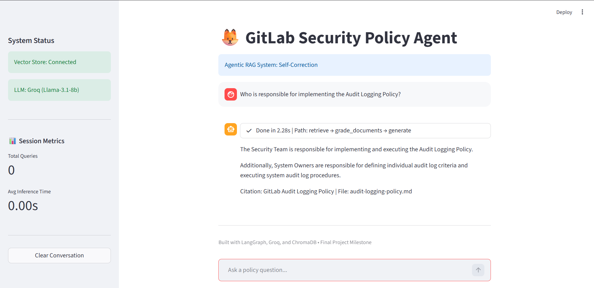
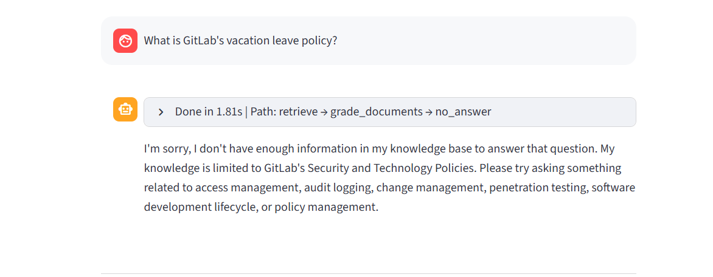
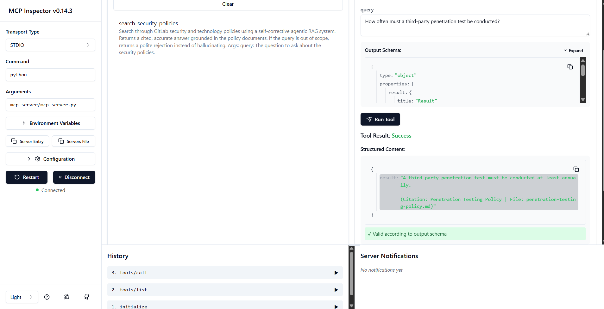
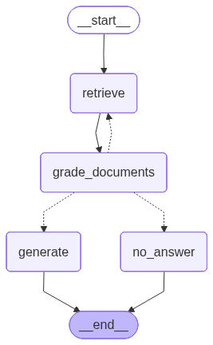

<h1 align="center">🦊 Agentic Doc Search RAG</h1>

<p align="center">
  <b>A production-grade, Self-Corrective Agentic RAG system that reasons before it answers —<br/>built to solve the silent hallucination problem in standard RAG pipelines.</b>
</p>

<p align="center">
  
  
  
  
  
  
  
</p>

---

## Table of Contents

- [Live Demo — Screenshots](#live-demo--screenshots)
- [Why This Project Exists — The Problem](#why-this-project-exists--the-problem)
- [The Solution: Agentic Self-Corrective RAG](#the-solution-agentic-self-corrective-rag)
- [Agent Architecture](#agent-architecture)
- [Core Design Decisions](#core-design-decisions)
- [Implementation Walkthrough](#implementation-walkthrough)
- [Tech Stack](#tech-stack)
- [MCP Server Integration](#mcp-server-integration)
- [Project Structure](#project-structure)
- [Setup & Run](#setup--run)
- [Sample Q&A Results](#sample-qa-results)
- [Engineering Highlights](#engineering-highlights)
- [License](#license)

---

## Live Demo — Screenshots

> The following screenshots demonstrate the system working end-to-end: correct answers with full agent path transparency, graceful out-of-scope rejection, live session metrics, and MCP server tool validation.

### 1. Accurate Policy Answer with Agent Path Trace
> Query about security policy responsibilities — system retrieves relevant chunks, grades them as relevant, and generates a cited answer. The agent path (`retrieve → grade_documents → generate`) is visible in real time.



---

### 2. Graceful Out-of-Scope Rejection — Zero Hallucination
> Query completely outside the document domain — the grading node correctly identifies retrieved chunks as irrelevant, routes to the `no_answer` node, and returns an honest rejection. No fabricated answer.



---


### 3. MCP Server Tool Validation — Inspector Confirmed
> The RAG system exposed as an MCP tool, called through MCP Inspector. Result validated as `✓ Valid according to output schema` — proving the server is production-ready for AI agent integration.



---

## Why This Project Exists — The Problem

Standard RAG (Retrieval-Augmented Generation) pipelines follow a fixed, linear path:

```
User Query → Retrieve Docs → Generate Answer
```

This architecture **always generates an answer** — regardless of whether the retrieved documents are actually relevant or whether the question is even in scope. In production, this creates three failure modes that are silent and dangerous:

### Failure Mode 1: Irrelevant Retrieval with Confident Hallucination
A vector similarity search returns the top-K "closest" chunks by embedding distance. But cosine similarity is not the same as semantic relevance. A chunk about "access token expiry" may rank high for a query about "password policy" — and the LLM will use it to generate a confident, wrong answer.

**Standard RAG produces no warning. The user never knows.**

### Failure Mode 2: No Out-of-Scope Handling
Ask a naive RAG about topics outside its documents ("How do I reset my GitLab password?") and it will still attempt to answer using whatever tangentially related chunks it found. This is not just wrong — in security and compliance contexts, it is dangerous misinformation.

### Failure Mode 3: No Transparency or Observability
A linear RAG pipeline gives users zero visibility into what happened: which documents were retrieved, whether they were relevant, how long inference took, and which policy produced the answer. Debugging hallucinations becomes guesswork.

**In high-stakes domains like security policy compliance, a hallucinated answer is not just unhelpful — it is a liability.**

---

## The Solution: Agentic Self-Corrective RAG

Instead of a fixed pipeline, this project implements an **agent** — a system that observes the situation and *decides* what to do at each step.

The agent is built as a **LangGraph StateGraph** with 4 specialised nodes. Between each node, the graph evaluates a condition and chooses the next path. This enables:

- **Self-correction**: If retrieved documents fail the relevance grade, the system routes away from generation rather than hallucinating.
- **Graceful rejection**: Queries outside the document domain get an honest "I don't have that information" response.
- **Full transparency**: Every node execution is visible to the user in real time, including timing and path.

The target corpus is a set of 6 **GitLab Security and Technology Policy** documents — a realistic enterprise compliance knowledge base covering Access Management, Audit Logging, Change Management, Penetration Testing, the SDLC, and overarching policy governance.

---

## Agent Architecture

The graph has **4 nodes** and **conditional routing**:

```
User Query
    │
    ▼
┌──────────────┐
│   retrieve   │  ← Embeds query, fetches top-6 chunks from ChromaDB (cosine similarity)
└──────┬───────┘   Stores both documents AND their metadata (policy_title, filename) in state
       │
       ▼
┌──────────────────────┐
│   grade_documents    │  ← Dedicated LLM call: "Are these docs relevant to the question?"
│   (Llama 3.1 8B)     │   Plain-text yes/no — avoids function-calling failures on small models
└──────┬───────────────┘
       │
   ┌───┴─────────────────────────┐
   │ yes (relevant)              │ no (irrelevant)
   ▼                             ▼
┌──────────┐              ┌─────────────┐
│ generate │              │  no_answer  │  ← Returns polite rejection, zero hallucination
│          │              │             │   Eliminates infinite retry loops
│ Formats context          └──────┬──────┘
│ with [Source: Policy |          │
│  File:] headers                 │
│ so LLM always cites             │
│ the correct document            │
└─────┬────┘                      │
      │                           │
      └─────────────┬─────────────┘
                    ▼
                   END
```

### Visual Graph (Auto-generated by LangGraph)



> This diagram is auto-generated by calling `graph.get_graph().draw_mermaid_png()` — it is the actual compiled execution graph, not a manual diagram.

---

## Core Design Decisions

> This table explains *why* each technical choice was made. Decisions made under constraints are where real engineering judgment shows.

| Decision | What Was Chosen | Why — The Reasoning |
|---|---|---|
| **Orchestration framework** | LangGraph `StateGraph` | Enables conditional branching, stateful loops, and graph-based routing — impossible in a plain LangChain `chain`. A chain always executes every step; a graph *decides* what to execute. |
| **Document grading node** | Dedicated LLM call before generation | Forces the agent to evaluate relevance before committing to an answer. Eliminates the root cause of RAG hallucination: using irrelevant context. |
| **Plain-text grading (not structured output)** | `yes`/`no` string response | Smaller open-source models like Llama 3.1 8B frequently fail at JSON function-calling / structured output. Plain-text prompting is more reliable at this scale. |
| **`no_answer` exit node** | Explicit graceful rejection path | Prevents the graph from looping infinitely when no relevant docs are found, and eliminates out-of-scope hallucination. |
| **Metadata-tagged context** | `[Source: Policy | File:]` prefix per chunk | Ensures the LLM has the citation available *inside the context window* — not retrieved separately. The model always knows which document each fact came from. |
| **Similarity search over MMR** | `search_type="similarity"` | Maximum Marginal Relevance (MMR) prioritises diversity, which caused wrong-policy chunks to be retrieved. Similarity search returns the most relevant chunks consistently. |
| **MemorySaver checkpointer** | Per-`thread_id` conversation state | Persists full conversation history across turns without re-processing documents. True multi-turn chat in a stateful graph. |
| **Local HuggingFace embeddings** | `sentence-transformers/all-MiniLM-L6-v2` | No API cost, no rate limits, no latency overhead for embedding calls. Fast enough for this corpus size and runs entirely offline. |
| **Groq inference** | Llama 3.1 8B Instant | Sub-second LLM responses even for complex policy questions — critical for a chat UI. Free tier is sufficient for development and demos. |
| **MCP server** | FastMCP over the RAG graph | Exposes the entire agent as a standard MCP tool, enabling AI agents (Claude Desktop, VS Code Copilot, etc.) to query the policy knowledge base directly. |

---

## Implementation Walkthrough

### Phase 1: Data Ingestion Pipeline

```
.md policy files → UnstructuredMarkdownLoader → Text Cleaner → RecursiveCharacterTextSplitter → ChromaDB
```

Each Markdown file is:
1. Loaded with `UnstructuredMarkdownLoader` (preserves section structure)
2. Cleaned (strip markdown headers and excess whitespace for embedding quality)
3. Split into overlapping chunks — `CHUNK_SIZE=800`, `CHUNK_OVERLAP=150` — to prevent information loss at section boundaries
4. Tagged with metadata: `{ "policy_title": "Audit Logging Policy", "filename": "audit-logging-policy.md" }`
5. Embedded with `all-MiniLM-L6-v2` and persisted to ChromaDB

The `CHUNK_OVERLAP=150` is intentional — it ensures that sentences spanning a chunk boundary are fully represented in both chunks, preventing partial context retrieval.

---

### Phase 2: Agent State

The graph shares a typed state dictionary `AgentState` across all nodes:

```python
class AgentState(TypedDict):
    messages:      Annotated[list[AnyMessage], add_messages]  # Full conversation history
    documents:     Optional[list[Document]]                   # Retrieved LangChain Documents
    doc_metadata:  Optional[list[dict]]                       # Extracted policy_title + filename per chunk
    next_action:   Optional[Literal["generate", "no_answer"]] # Grader's routing decision
```

The `doc_metadata` field is the key to correct citations — it is populated by `retrieve_node` and consumed by `generate_node` to build the `[Source: Policy | File:]` context headers.

---

### Phase 3: The Four Nodes

**`retrieve_node`**
```python
# Embeds query, fetches top-6 chunks, stores both documents AND metadata in state
results = retriever.invoke(query)
doc_metadata = [{"policy_title": d.metadata["policy_title"], 
                 "filename": d.metadata["filename"]} for d in results]
return {"documents": results, "doc_metadata": doc_metadata}
```

**`grade_documents_node`**
```python
# Plain-text yes/no grading — avoids structured output failures on small models
prompt = f"Question: {query}\nDocuments: {content}\nAre these documents relevant? Answer yes or no."
response = llm.invoke(prompt)
next_action = "generate" if "yes" in response.content.lower() else "no_answer"
return {"next_action": next_action}
```

**`generate_node`**
```python
# Tags each chunk with [Source: Policy | File:] so the LLM can always cite correctly
context_parts = []
for doc, meta in zip(documents, doc_metadata):
    header = f"[Source: {meta['policy_title']} | File: {meta['filename']}]"
    context_parts.append(f"{header}\n{doc.page_content}")
formatted_context = "\n\n---\n\n".join(context_parts)
```

**`no_answer_node`**
```python
# Honest rejection — no hallucination, no retry loop
message = "I could not find relevant information in the policy documents to answer your question."
return {"messages": [AIMessage(content=message)]}
```

---

### Phase 4: Conditional Routing

```python
graph.add_conditional_edges(
    "grade_documents",
    lambda state: state["next_action"],   # reads grader's decision from state
    {"generate": "generate", "no_answer": "no_answer"}
)
```

The router reads directly from `AgentState["next_action"]` — set by the grader — and routes to the correct node. This is the core of the agent's decision-making.

---

### Phase 5: Streamlit UI with Observability

The UI uses `graph.stream(input, config, stream_mode="updates")` to receive each node's output as it executes. This enables:
- **Real-time agent step display** via `st.status` — users see `retrieve → grade_documents → generate` as it happens
- **Inference timing** — `time.time()` wraps the entire stream call; elapsed time is displayed in the status bar
- **Session metrics sidebar** — cumulative query count, running average inference time, last query duration, last agent path

---

## Tech Stack

| Layer | Technology | Version | Role |
|---|---|---|---|
| **Agent Orchestration** | [LangGraph](https://github.com/langchain-ai/langgraph) | Latest | Stateful graph with conditional edges, loops, and memory |
| **LLM Inference** | [Groq](https://groq.com) — Llama 3.1 8B Instant | API | Ultra-fast inference for both grading (~100ms) and generation |
| **Embeddings** | `sentence-transformers/all-MiniLM-L6-v2` | HuggingFace | Local embedding model — no API cost, no rate limits |
| **Vector Store** | [ChromaDB](https://www.trychroma.com/) | `langchain-chroma` | Persistent local vector database with cosine similarity |
| **Document Loading** | `UnstructuredMarkdownLoader` | LangChain | Parses `.md` policy files preserving structure |
| **Text Splitting** | `RecursiveCharacterTextSplitter` | LangChain | Overlapping chunk strategy for context continuity |
| **Chat UI** | [Streamlit](https://streamlit.io) | Latest | Streaming chat with real-time agent status and metrics |
| **Conversation Memory** | LangGraph `MemorySaver` | Built-in | Per-session state persistence via `thread_id` |
| **MCP Protocol** | [FastMCP](https://github.com/jlowin/fastmcp) | Latest | Exposes RAG as a callable MCP tool for AI agents |
| **Language** | Python | 3.11 | Core implementation |

---

## MCP Server Integration

Beyond the Streamlit UI, this project exposes the entire RAG agent as a **Model Context Protocol (MCP) server** — making it usable by any MCP-compatible AI client (Claude Desktop, VS Code Copilot Chat, Cursor, etc.).

### What is MCP?
MCP (Model Context Protocol) is an open standard that lets AI assistants call external tools through a structured interface. By wrapping the RAG pipeline as an MCP tool, any AI agent can query these policy documents as a first-class tool call.

### What the MCP Server Exposes

| Type | Name | Description |
|---|---|---|
| **Tool** | `search_security_policies` | Takes a natural language query, runs the full agentic RAG graph, returns the answer as a string |
| **Resource** | `policies://list` | Returns the list of all indexed policy document names |

### Server Implementation Highlights
- **`sys.path` injection** — Server file lives in `mcp-server/` subdirectory; project root is added to path so `src.*` imports resolve correctly
- **Logging suppression** — `transformers`, `sentence_transformers`, and `chromadb` loggers set to `ERROR` level to prevent noise in MCP Inspector stderr
- **String return type** — FastMCP requires tools to return primitive types; the `AIMessage.content` string is extracted before return to pass Pydantic validation
- **Correct input format** — Wraps query in `HumanMessage` before invoking the graph, matching the state schema exactly

```python
# mcp-server/mcp_server.py — core tool
@mcp.tool()
def search_security_policies(query: str) -> str:
    """Search GitLab security and technology policy documents using an agentic RAG pipeline."""
    agent = build_graph()
    config = {"configurable": {"thread_id": "mcp-session"}}
    result = agent.invoke({"messages": [HumanMessage(content=query)]}, config=config)
    for msg in reversed(result["messages"]):
        if isinstance(msg, AIMessage):
            return msg.content
    return "No answer could be generated."
```

### Running the MCP Server
```bash
cd mcp-server
python mcp_server.py
```

### Validating with MCP Inspector
```bash
npx @modelcontextprotocol/inspector@0.14.3 python mcp_server.py
```


---

## Project Structure

```
DocRAGSearch/
│
├── app.py                          # Streamlit chat UI — streaming, agent status, session metrics
├── save_graph.py                   # One-time utility: generates agent_graph.png from compiled graph
├── agent_graph.png                 # Auto-generated LangGraph execution graph diagram
├── pyproject.toml                  # Project dependencies (uv/pip compatible)
├── .env                            # API keys — NOT committed
│
├── assets/                         # Screenshots for README showcase
│   ├── SS1.png                     # Accurate policy answer with agent path trace
│   ├── SS2.png                     # Graceful out-of-scope rejection
│   ├── SS3.png                     # Session metrics sidebar
│   └── SS4.png                     # MCP Inspector tool validation
│
├── data/
│   └── security-and-technology-policies/
│       ├── access-management-policy.md
│       ├── audit-logging-policy.md
│       ├── change-management-policy.md
│       ├── penetration-testing-policy.md
│       ├── software-development-lifecycle-policy.md
│       └── security-and-technology-policies-management.md
│
├── db/
│   └── chroma_db/                  # Persisted ChromaDB vector store (not committed)
│
├── mcp-server/
│   ├── mcp_server.py               # FastMCP server — exposes RAG as MCP tool + resource
│   └── test_client.py              # Direct Python test client (no MCP protocol needed)
│
└── src/
    ├── config.py                   # Centralized config: env vars, model names, chunk parameters
    ├── state.py                    # LangGraph AgentState TypedDict
    ├── graph.py                    # All 4 nodes + conditional routing + graph compilation
    ├── prompts.py                  # RAG system prompt (hardened against hedging)
    ├── data_ingestion.py           # Markdown loader → text cleaner → chunker → metadata tagger
    ├── vector_store.py             # ChromaDB create + retriever factory
    ├── schema.py                   # Pydantic schemas
    └── utils.py                    # Utility helpers
```

---

## Setup & Run

### 1. Clone the repository
```bash
git clone https://github.com/BrijeshRakhasiya/Agentic-Doc-Search-RAG.git
cd Agentic-Doc-Search-RAG
```

### 2. Create and activate a virtual environment
```bash
python -m venv .venv

# Windows
.venv\Scripts\activate

# macOS / Linux
source .venv/bin/activate
```

### 3. Install dependencies
```bash
pip install -e .
```

### 4. Set up environment variables
Create a `.env` file in the project root:
```env
GROQ_API_KEY=your_groq_api_key_here
```
Get a free API key at [console.groq.com](https://console.groq.com)

### 5. Build the vector store (run once)
```bash
python -c "
from src.data_ingestion import DataIngestor
from src.vector_store import VectorStoreManager
ingestor = DataIngestor()
chunks = ingestor.load_and_split()
VectorStoreManager().create_vector_store(chunks)
"
```

### 6. Launch the Streamlit app
```bash
streamlit run app.py
```

### 7. (Optional) Launch the MCP server
```bash
cd mcp-server
python mcp_server.py
```

### 8. (Optional) Regenerate the agent graph diagram
```bash
python save_graph.py
```

---

## Sample Q&A Results

| Question | Agent Path | Behavior |
|---|---|---|
| *"Who is responsible for implementing the Audit Logging Policy?"* | `retrieve → grade → generate` | Correctly identifies Security Team as responsible owner |
| *"What system tiers are in scope for Change Management?"* | `retrieve → grade → generate` | Returns Tier 1, 2, 3 in-scope; Tier 4 explicitly excluded |
| *"What happens after a penetration test finds critical vulnerabilities?"* | `retrieve → grade → generate` | Cites CM-3/pen testing policy: assess severity, Vuln Management Standard, retest requirement |
| *"How often must penetration tests be conducted?"* | `retrieve → grade → generate` | Answers: at minimum annually, and after significant system changes |
| *"How do I reset my GitLab password?"* | `retrieve → grade → no_answer` | Retrieves docs, grades as NOT relevant, routes to rejection — zero hallucination |
| *"What is the company's vacation policy?"* | `retrieve → grade → no_answer` | Completely out-of-scope query handled cleanly — polite, accurate rejection |

---

## Engineering Highlights

### What Makes This Different from Standard RAG

| Standard RAG Pipeline | This System |
|---|---|
| Always generates an answer | Only generates when docs pass relevance grading |
| Silently hallucinates on irrelevant retrieval | Routes to explicit `no_answer` node |
| No visibility into what was retrieved | Full agent path in UI (`retrieve → grade → generate`) |
| No citation tracking | Every chunk tagged `[Source: Policy \| File:]` before generation |
| Single-use query | Multi-turn chat via `MemorySaver` + `thread_id` |
| Linear, no self-correction | Conditional routing — the agent decides what to do |
| UI only | Also exposed as MCP tool for AI agent integration |

### Specific Engineering Decisions That Prevented Bugs

1. **Plain-text grading over structured output** — Llama 3.1 8B failed structured output / function-calling consistently. Switching to plain `yes/no` prompting eliminated `BadRequestError` entirely.

2. **`override=True` in `load_dotenv`** — Without this flag, `dotenv` skips variables already set in the environment. The API key appeared to load but was ignored, causing `AuthenticationError` at runtime.

3. **Explicit `next_action` key in grader return** — The grader initially returned `{"generate": "yes"}` (wrong key). The router was reading `state["next_action"]` (correct key). This mismatch caused a `KeyError` on every query. Fixed by aligning the return key to match the state field name.

4. **Similarity search over MMR** — MMR's diversity-first heuristic was retrieving chunks from unrelated policies when the query matched multiple documents. Switching to pure similarity search ensured the most relevant document's chunks dominated the top-6 results.

5. **Metadata stored separately from documents** — LangChain `Document` objects carry `.metadata` but the generate node needed a clean, structured list of `{policy_title, filename}` pairs indexed to match the documents list. Storing `doc_metadata` as a separate state field made this clean and reliable.

---

## License

This project is licensed under the **MIT License** — see [LICENSE](LICENSE) for details.

```
MIT License — Copyright (c) 2026 Brijesh Rakhasiya
```

---

<p align="center">
  Built with care by <b>Brijesh Rakhasiya</b><br/>
  <a href="https://github.com/BrijeshRakhasiya">GitHub Profile</a> &nbsp;•&nbsp;
  <a href="https://github.com/BrijeshRakhasiya/Agentic-Doc-Search-RAG">Repository</a>
</p>

